# Huawei CSI Driver 规格文档管理全流程

## 一、存量摸底：把现有代码和架构梳理清楚

借助AI伙伴完成工程代码全量扫描，摸清华为CSI驱动的架构逻辑、各个模块是干什么的，相当于给现有项目做了一次全面体检。

### 1.1 整体架构梳理

AI梳理结果：
```markdown
Assistant (Build · qwen3.6-plus · 106.3s)

_Thinking:_

好的，现在我已经对这个项目的整体架构有了非常深入的理解。让我来整理一下，给用户一个清晰的架构图和模块依赖关系分析。

好的，经过深入探索，我现在对这个项目的整体架构有了清晰的认识。让我来为你梳理一下。


---
Huawei CSI Driver 整体架构
一、宏观架构：双进程模型
┌─────────────────────────────────────────────────────────────────┐
│                        Kubernetes Cluster                       │
│                                                                 │
│  ┌──────────────────────────┐    ┌──────────────────────────┐   │
│  │   huawei-csi-controller  │    │     huawei-csi-node      │   │
│  │    (StatefulSet/Deploy)  │    │       (DaemonSet)        │   │
│  │                          │    │                          │   │
│  │  ┌────────────────────┐  │    │  ┌────────────────────┐  │   │
│  │  │  CSI gRPC Server   │  │    │  │  CSI gRPC Server   │  │   │
│  │  │  - Identity        │  │    │  │  - Identity        │  │   │
│  │  │  - Controller      │  │    │  │  - Node            │  │   │
│  │  │  - DRCSI (ext)     │  │    │  │                    │  │   │
│  │  └────────┬───────────┘  │    │  └────────┬───────────┘  │   │
│  │           │              │    │           │              │   │
│  │  ┌────────▼───────────┐  │    │  ┌────────▼───────────┐  │   │
│  │  │  BackendSelector   │  │    │  │      Manager       │  │   │
│  │  │  BackendRegister   │  │    │  │     (SAN/NAS)      │  │   │
│  │  │  BackendCache      │  │    │  │                    │  │   │
│  │  └────────┬───────────┘  │    │  └────────┬───────────┘  │   │
│  │           │              │    │           │              │   │
│  │  ┌────────▼───────────┐  │    │  ┌────────▼───────────┐  │   │
│  │  │  BackendController │  │    │  │    Connector       │  │   │
│  │  │  (CRD Controller)  │  │    │  │  (iSCSI/FC/NFS..)  │  │   │
│  │  └────────┬───────────┘  │    │  └────────┬───────────┘  │   │
│  │           │              │    │           │              │   │
│  └───────────┼──────────────┘    └───────────┼──────────────┘   │
│              │                               │                  │
│              ▼                               ▼                  │
│  ┌───────────────────────────────────────────────────────────┐  │
│  │                    Plugin Layer                           │  │
│  │  oceanstor-san │ oceanstor-nas │ fusionstorage-san │ ...  │  │
│  └───────────────────────────┬───────────────────────────────┘  │
│                              │                                  │
│                              ▼                                  │
│              ┌───────────────────────────────┐                  │
│              │   Storage Backend (REST API)  │                  │
│              │  OceanStor / FusionStorage    │                  │
│              └───────────────────────────────┘                  │
└─────────────────────────────────────────────────────────────────┘
```
> 注：架构整体准确，仅需修正BackendController箭头指向问题。

### 1.2 核心模块职责

AI梳理结果：

| 模块                 | 路径                     | 职责                                        |
|--------------------|------------------------|-------------------------------------------|
| **driver**         | `csi/driver/`          | CSI gRPC 服务实现 (Identity/Controller/Node)  |
| **backend**        | `csi/backend/`         | 后端管理: 缓存、过滤、选择、插件                         |
| **plugin**         | `csi/backend/plugin/`  | 存储产品适配 (oceanstor-san/nas, fusionstorage) |
| **connector**      | `connector/`           | 传输协议适配 (iSCSI/FC/RoCE/NVMe/NFS)           |
| **manage**         | `csi/manage/`          | Node 侧卷管理 (SanManager/NasManager)         |
| **handler**        | `csi/backend/handler/` | 后端注册/获取/选择/缓存的组合操作                        |
| **storage**        | `storage/`             | 存储阵列 REST API 客户端                         |
| **CRD Controller** | `pkg/storage-backend/` | 管理 StorageBackendClaim/Content 生命周期       |
| **provider**       | `csi/provider/`        | DRCSI 扩展服务 (存储后端查询等)                      |

### 1.3 基线规格文档生成

摸清架构之后，我们用 `/opsx-explore` 指令，让AI自动生成初始规格文档：

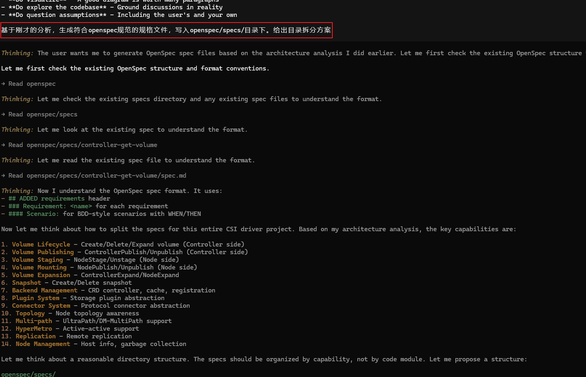

初始生成结果：

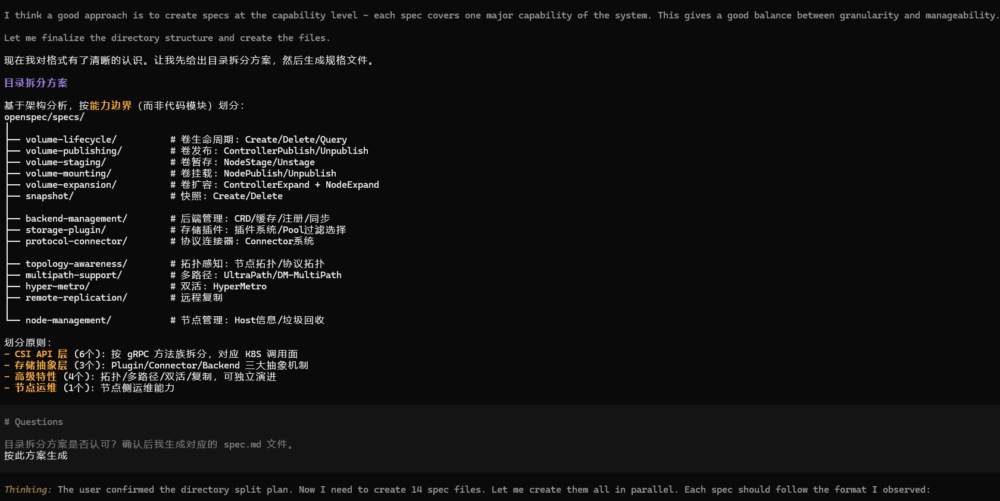

生成规格文档过程：

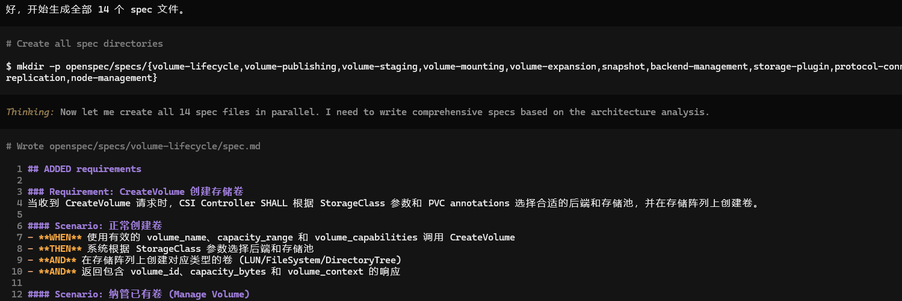

一开始文档是按能力聚合的，看着很乱。所以让AI单独把CSI北向接口拆出来，严格按照官方CSI规范分类。

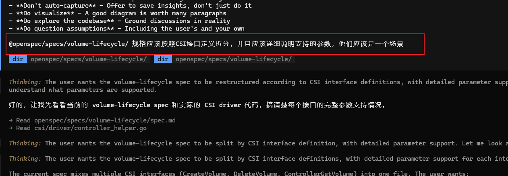

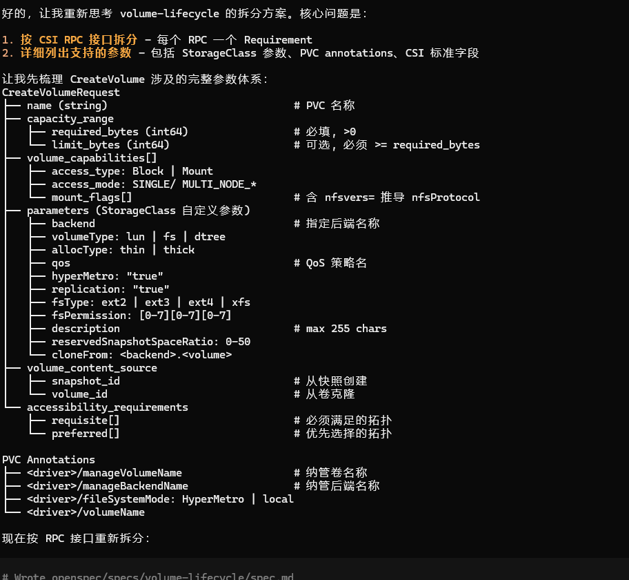

### 1.4 基线规格验证

经多轮修正后，最终整理出33项规格文档：

```text
33/33 全部通过验证
openspec/specs/
├── backend-cli/                          # oceanctl CLI 命令：后端和证书的创建/查询/更新/删除，日志收集，版本显示
├── backend-controllers/                  # storage-backend-controller 和 sidecar-controller：SBC/SBCT 生命周期管理、状态同步、finalizer 管理
├── backend-dr-csi/                       # DR-CSI StorageBackend gRPC 服务：后端注册、状态查询、后端列表、注销
├── connector-fc/                         # FC（光纤通道）协议连接器：连接/断开 FC 卷，支持 UltraPath 和 DM-Multipath
├── connector-fc-nvme/                    # FC-NVMe 协议连接器：通过 FC 传输 NVMe，发现子系统和命名空间
├── connector-iscsi/                      # iSCSI 协议连接器：连接/断开 iSCSI 卷，支持 CHAP 认证和多路径
├── connector-local/                      # Local SCSI 协议连接器：FusionStorage 直连卷的附加/分离
├── connector-nfs/                        # NFS 协议连接器：挂载/卸载 NFS 文件系统共享
├── connector-nfs-plus/                   # NFS+ 协议连接器：增强 NFS，支持多门户和标签式访问控制
├── connector-nvme/                       # NVMe over Fabrics 连接器：通过 RoCE/TCP 连接/断开 NVMe 卷
├── crd-types/                            # CRD 定义：StorageBackendClaim、StorageBackendContent、VolumeModifyClaim、VolumeModifyContent
├── csi-controller-create-snapshot/       # CreateSnapshot RPC：创建卷快照
├── csi-controller-create-volume/         # CreateVolume RPC：创建卷 + 池过滤/权重选择/拓扑匹配/双活/远程复制
├── csi-controller-delete-snapshot/       # DeleteSnapshot RPC + ListSnapshots（未实现）：删除卷快照
├── csi-controller-delete-volume/         # DeleteVolume RPC：删除卷（LUN/FileSystem/DTree）
├── csi-controller-expand-volume/         # ControllerExpandVolume RPC：控制器端卷扩容
├── csi-controller-get-capabilities/      # ControllerGetCapabilities RPC + 未实现 RPCs（ListVolumes 等）
├── csi-controller-publish-volume/        # ControllerPublishVolume RPC：将卷附加到节点，返回映射信息
├── csi-controller-unpublish-volume/      # ControllerUnpublishVolume RPC：从节点分离卷
├── csi-identity-get-plugin-capabilities/ # GetPluginCapabilities RPC：声明 CONTROLLER_SERVICE 和 VOLUME_ACCESSIBILITY_CONSTRAINTS 能力
├── csi-identity-get-plugin-info/         # GetPluginInfo RPC：返回驱动名称和供应商版本
├── csi-identity-probe/                   # Probe RPC：驱动健康检查
├── csi-node-expand-volume/               # NodeExpandVolume RPC：节点端卷扩容（块设备 + 文件系统）
├── csi-node-get-capabilities/            # NodeGetCapabilities RPC：声明 STAGE_UNSTAGE_VOLUME、EXPAND_VOLUME、GET_VOLUME_STATS 能力
├── csi-node-get-info/                    # NodeGetInfo RPC：返回节点 ID（HostName JSON）和拓扑信息
├── csi-node-get-volume-stats/            # NodeGetVolumeStats RPC：返回卷使用统计（字节和 inode）
├── csi-node-publish-volume/              # NodePublishVolume RPC：将已暂存的卷发布到节点目标路径
├── csi-node-stage-volume/                # NodeStageVolume RPC：在节点上暂存卷（SAN 连接/NAS 挂载）
├── csi-node-unpublish-volume/            # NodeUnpublishVolume RPC：从节点目标路径卸载卷
├── csi-node-unstage-volume/              # NodeUnstageVolume RPC：从节点暂存路径卸载并断开卷
├── storage-plugins/                      # 存储阵列插件：OceanStor SAN/NAS、DTree、A-Series、DME、FusionStorage、OceanDisk
├── volume-modification/                  # 批量卷修改：VMC/VMContent 生命周期、DR-CSI ModifyVolume 服务、双活转换
└── webhook/                              # SBC 准入验证 Webhook：Provider 必填、ConfigMapMeta/SecretMeta 格式、不可变字段校验
```

执行验证命令，全部校验成功：

```shell
$ openspec validate
✔ What would you like to validate? All (changes + specs)
✓ spec/backend-cli
✓ spec/backend-controllers
✓ spec/backend-dr-csi
✓ spec/connector-fc
✓ spec/connector-fc-nvme
✓ spec/connector-iscsi
✓ spec/connector-local
✓ spec/connector-nfs
✓ spec/connector-nfs-plus
✓ spec/connector-nvme
✓ spec/crd-types
✓ spec/csi-controller-create-snapshot
✓ spec/csi-controller-create-volume
✓ spec/csi-controller-delete-snapshot
✓ spec/csi-controller-delete-volume
✓ spec/csi-controller-expand-volume
✓ spec/csi-controller-get-capabilities
✓ spec/csi-controller-publish-volume
✓ spec/csi-controller-unpublish-volume
✓ spec/csi-identity-get-plugin-capabilities
✓ spec/csi-identity-get-plugin-info
✓ spec/csi-identity-probe
✓ spec/csi-node-expand-volume
✓ spec/csi-node-get-capabilities
✓ spec/csi-node-get-info
✓ spec/csi-node-get-volume-stats
✓ spec/csi-node-publish-volume
✓ spec/csi-node-stage-volume
✓ spec/csi-node-unpublish-volume
✓ spec/csi-node-unstage-volume
✓ spec/storage-plugins
✓ spec/volume-modification
✓ spec/webhook
Totals: 33 passed, 0 failed (33 items)
```

## 二、增量开发：基于现有基线做新需求迭代

基线整理完成后，我们开始开发新功能。整套流程完全遵循OpenSpec标准：  
```text
Propose（提案）→ Design（设计）→ Specs（规格）→ Tasks（任务）→ Apply（实现）→ Archive（归档）
```

### 2.1 Propose阶段：说清楚为什么改、改什么

这个阶段只搞明白三件事：为什么要做、要改哪些内容、影响哪些模块。也就是以下三个关键问题：
1. **Why**：为什么要变更；
2. **What**：具体变更内容；
3. **Capabilities**：涉及的模块变更范围。

#### 2.1.1 核心原则

- 基于已有知识库（存量基线）发起变更，不凭空开发；
- 提前圈定改动范围，为后续设计与规格修改划定边界。

#### 2.1.2 提案实操流程

第一步：把业务需求翻译成技术需求，交给AI分析：

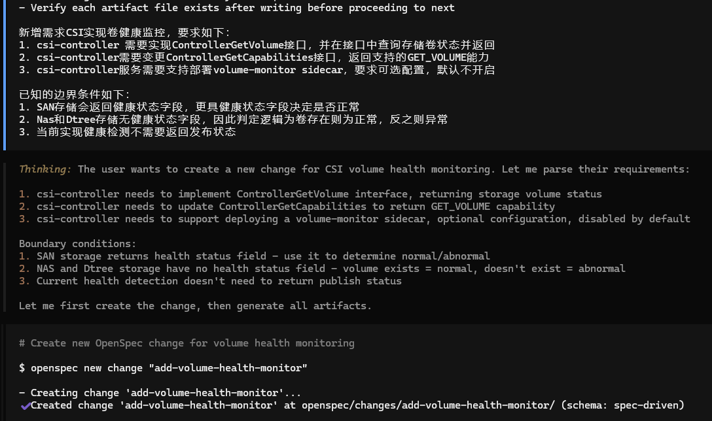

可以看到提交任务后，OpenSpec通过SubAgent在隔离session中分析代码仓库，避免源码阅读的上下文开销影响主流程：

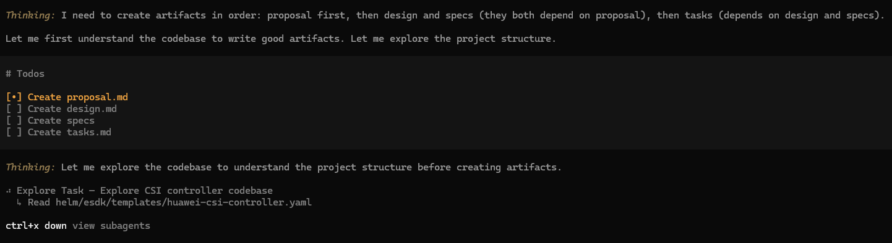

深入分析可以看到OpenSpec提交了如下任务给SubAgent：

```text
Explore the codebase to understand the CSI controller implementation. I need to find:
1. The main CSI controller server code - where ControllerGetCapabilities is implemented
2. How the CSI server is structured (gRPC server, handlers)
3. Any existing volume-related operations
4. How SAN, NAS, and Dtree storage types are handled
5. The deployment/Helm charts for csi-controller (look for sidecar container definitions)
6. Any existing health check or monitoring code
Search thoroughly across the entire project. Look in directories like:
- pkg/
- cmd/
- deploy/ or helm/ or charts/
- Any proto files
Return:
- File paths and line numbers for ControllerGetCapabilities implementation
- File paths for CSI controller server setup
- How storage types (SAN, NAS, Dtree) are differentiated in code
- Helm/deployment file paths for csi-controller
- Any relevant proto definitions for ControllerGetVolume
- The overall project structure summary
```

AI很快识别出本次改动会影响现有基线规格：
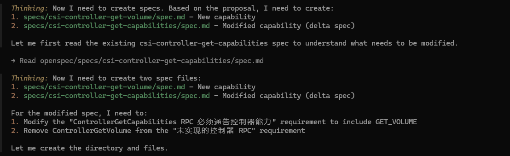

分析结束后，自动生成本次变更的所有文档：
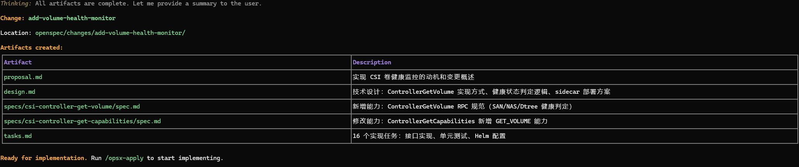

#### 2.1.3 提案文档(proposal.md)

以下为AI生成信息，回答了Why、What、Capabilities三个关键问题。

```markdown
## Why

Kubernetes CSI 外部健康检查器（External Health Monitor）依赖 CSI 驱动的 `ControllerGetVolume`
接口来获取存储卷的健康状态。当前驱动未实现该接口，导致无法向 Kubernetes 报告卷的健康状况，运维人员无法及时发现存储卷异常，影响集群的可靠性和可观测性。

## What Changes

- 实现 `ControllerGetVolume` RPC 接口，查询存储卷健康状态并返回
- 修改 `ControllerGetCapabilities` 接口，新增 `GET_VOLUME` 能力通告
- 新增 volume-monitor sidecar 部署支持，作为可选配置，默认不开启

## Capabilities

### New Capabilities

- `csi-controller-get-volume`: 实现 ControllerGetVolume RPC，返回存储卷的健康状态。支持 SAN 存储（基于健康状态字段判断）、NAS
  和 Dtree 存储（基于卷是否存在判断）
- `storage-plugin-health-query`: 新增 StoragePlugin.QueryVolumeHealth 轻量级接口，避免 QueryVolume 的冗余查询。返回
  VolumeHealth{Healthy, Message} 结构体

### Modified Capabilities

- `csi-controller-get-capabilities`: ControllerGetCapabilities 接口需新增 GET_VOLUME 能力返回

## Impact

- `pkg/csi/controller/server.go`: 新增 ControllerGetVolume 实现，修改 ControllerGetCapabilities 返回
- `pkg/monitor/`: 新增 volume-monitor sidecar 相关代码
- Helm charts / 部署配置: 新增 volume-monitor sidecar 可选部署配置
- 存储后端适配层: SAN、NAS、Dtree 存储插件需支持健康状态查询
```

#### 2.2 Design设计阶段：敲定技术方案，写明取舍原因

核心是做出技术决策，设计文档不写空话，全部是**落地决策+为什么这么做**。

````markdown
## Context

当前 CSI 驱动未实现 `ControllerGetVolume` RPC，对所有请求返回 `codes.Unimplemented`。Kubernetes
外部健康检查器（csi-external-health-monitor-controller）依赖此接口获取卷健康状态，用于在 PVC 上设置 `VolumeHealth` 条件。

现有存储后端：

- **SAN 存储**（oceanstor-san, fusionstorage-san）：存储阵列返回 LUN 的 `HEALTHSTATUS` 字段，可用于判断健康状态
- **NAS 存储**（oceanstor-nas, fusionstorage-nas）：通过卷是否存在判断健康状态
- **Dtree 存储**（oceanstor-dtree, fusionstorage-dtree）：目录树无明确健康状态字段，通过卷是否存在判断

约束：

- volume-monitor sidecar 使用社区官方镜像 `registry.k8s.io/sig-storage/csi-external-health-monitor-controller:v0.10.0`
- 默认不开启 volume-monitor sidecar
- 不需要返回发布状态（VolumeCondition 中的 `published` 字段）
- 不复用现有 `QueryVolume` 接口（存在冗余查询），需新增专用健康检查接口

## Goals / Non-Goals

**Goals:**

- 实现 `ControllerGetVolume` RPC，返回卷 ID 和健康状态
- 修改 `ControllerGetCapabilities` 返回 `GET_VOLUME` 能力
- 提供可选的 volume-monitor sidecar 部署配置
- 支持 SAN/NAS/Dtree 三种存储类型的健康状态判定
- 新增轻量级 `QueryVolumeHealth` 接口，避免 QueryVolume 的冗余查询

**Non-Goals:**

- 不实现 Volume 发布状态检测
- 不修改现有卷创建/删除/扩容逻辑
- 不实现 Node 侧的健康检测（已有 NodeGetVolumeStats）
- 不实现 `ListVolumes` 接口

## Decisions

### Decision 1: 新增 QueryVolumeHealth 专用接口

**选择**: 在 `StoragePlugin` interface 中新增 `QueryVolumeHealth` 方法，而非复用 `QueryVolume`。

```go
type VolumeHealth struct {
    Healthy bool   // 卷是否健康
    Message string // 健康状态描述信息（异常时提供原因）
}

QueryVolumeHealth(ctx context.Context, name string, params map[string]interface{}) (*VolumeHealth, error)
```

**QueryVolume 的冗余问题**:

- **SAN**: 查询完整 LUN 对象（50+字段），含 `validateManageWorkLoadType` 额外调用
- **NAS**: 查询完整 filesystem 对象（30+字段），含 workload 验证
- **Dtree**: 调用 **2 次 API**（GetDTreeByName + BatchGetQuota）

**QueryVolumeHealth 的轻量实现**:

- **SAN**: 仅查询 LUN 基本信息，检查 `HEALTHSTATUS` 字段
- **NAS**: 仅查询 filesystem 是否存在
- **Dtree**: 仅查询 DTree 是否存在

**理由**:

- 健康检查是高频调用，需避免不必要的 API 开销
- 专用接口职责单一，便于后续优化和测试
- 与现有 QueryVolume 解耦，互不影响

**替代方案**:

- 复用 QueryVolume：实现简单但性能差，不符合高频健康检查场景
- 创建独立的健康检查服务：增加复杂度，不必要

### Decision 2: 健康状态判定逻辑

**选择**: 按存储类型差异化处理：

- **SAN**: 查询 LUN 的 `HEALTHSTATUS` 字段，值为 `"1"` 表示正常，其他值表示异常，Message 记录具体状态码
- **NAS**: 调用轻量查询，卷存在则 Healthy=true，卷不存在则 Healthy=false
- **Dtree**: 同 NAS 逻辑

**理由**:

- SAN 存储的 LUN 对象有明确的 `HEALTHSTATUS` 字段，可提供更精确的健康判断
- NAS 文件系统虽有 HEALTHSTATUS 字段，但按需求采用卷存在性判定
- Dtree 目录树无健康状态字段，卷存在即正常是合理的判定方式

### Decision 3: Volume-monitor Sidecar 部署方式

**选择**: 在 csi-controller Pod 中以 sidecar 容器形式部署社区官方 sidecar。

**Sidecar 信息**:

- 名称: `csi-external-health-monitor-controller`
- 镜像: `registry.k8s.io/sig-storage/csi-external-health-monitor-controller:v0.10.0`
- 启动参数: `--csiAddress=/csi/csi.sock --monitor-interval=60s`

**Sidecar 职责**:

- 定期调用 CSI Driver 的 `ControllerGetVolume` 接口
- 将健康状态上报到 Kubernetes PVC 的 `VolumeHealth` 条件

**配置方式**:

- `values.yaml` 中新增 `controller.volumeMonitor.enabled` 字段，默认 `false`
- 启用时在 Deployment 中添加 sidecar 容器
- 保持 `ListVolumes` 为 Unimplemented，强制 sidecar 使用 `ControllerGetVolume`

**理由**:

- 使用社区官方 sidecar，无需自研维护
- Sidecar 模式与现有 csi-provisioner/attacher 等 sidecar 保持一致
- 共享 CSI socket，无需额外网络配置
- 可选配置满足用户需求

### Decision 4: 健康状态缓存策略

**选择**: `ControllerGetVolume` 每次调用实时查询存储后端，不做缓存。

**理由**:

- CSI 规范要求实时状态
- 外部健康检查器调用频率可控（默认 1 分钟）
- 避免缓存导致的状态延迟

## Risks / Trade-offs

| Risk | Mitigation |
|------|-----------|
| 存储后端不可用时 ControllerGetVolume 调用超时 | 设置合理的超时时间，返回适当错误码 |
| 大量卷同时查询对存储后端造成压力 | 外部健康检查器有内置限流，sidecar 可配置检查间隔 |
| NAS/Dtree 存储无法检测文件系统内部故障 | 明确文档说明，仅检测卷级别存在性 |
| Sidecar 增加 Pod 资源消耗 | 默认关闭，用户按需启用；sidecar 资源请求设置合理下限 |

````

#### 2.3 Specs规格阶段：定死开发标准、验收场景

Specs（规格） 是最关键的一步。规格定义了"做什么"和"怎么验证"，是代码实现的蓝图
**规格的结构**
- 每个规格包含多个 Requirement，每个 Requirement 包含多个 Scenario
- 到了 Specs 阶段，我们做的就不是泛泛而谈的“方案讨论”了，而是把新需求落到具体 requirement 和 scenario 上。

```markdown
## ADDED Requirements

### Requirement: ControllerGetVolume RPC 必须返回卷健康状态

ControllerGetVolume RPC SHALL 查询存储后端并返回卷的健康状态。返回的 VolumeCondition 中 `healthy` 字段表示卷健康状态，
`abnormal` 字段不返回。驱动 SHALL NOT 返回 `published` 字段。

#### Scenario: SAN 存储卷健康状态正常

- **WHEN** CO 发送 ControllerGetVolumeRequest，请求 SAN 类型存储卷且存储返回 HEALTHSTATUS 为 "1"
- **THEN** 驱动返回 ControllerGetVolumeResponse，VolumeCondition 中 `healthy` 为 true

#### Scenario: SAN 存储卷健康状态异常

- **WHEN** CO 发送 ControllerGetVolumeRequest，请求 SAN 类型存储卷且存储返回 HEALTHSTATUS 不为 "1"
- **THEN** 驱动返回 ControllerGetVolumeResponse，VolumeCondition 中 `healthy` 为 false

#### Scenario: NAS 存储卷存在

- **WHEN** CO 发送 ControllerGetVolumeRequest，请求 NAS 类型存储卷且卷存在
- **THEN** 驱动返回 ControllerGetVolumeResponse，VolumeCondition 中 `healthy` 为 true

#### Scenario: NAS 存储卷不存在

- **WHEN** CO 发送 ControllerGetVolumeRequest，请求 NAS 类型存储卷且卷不存在
- **THEN** 驱动返回 ControllerGetVolumeResponse，VolumeCondition 中 `healthy` 为 false

#### Scenario: Dtree 存储卷存在

- **WHEN** CO 发送 ControllerGetVolumeRequest，请求 Dtree 类型存储卷且卷存在
- **THEN** 驱动返回 ControllerGetVolumeResponse，VolumeCondition 中 `healthy` 为 true

#### Scenario: Dtree 存储卷不存在

- **WHEN** CO 发送 ControllerGetVolumeRequest，请求 Dtree 类型存储卷且卷不存在
- **THEN** 驱动返回 ControllerGetVolumeResponse，VolumeCondition 中 `healthy` 为 false

#### Scenario: 请求的卷 ID 无效

- **WHEN** CO 发送 ControllerGetVolumeRequest，卷 ID 为空
- **THEN** 驱动返回 codes.InvalidArgument 错误

#### Scenario: 存储后端不可用

- **WHEN** CO 发送 ControllerGetVolumeRequest，存储后端不可达
- **THEN** 驱动返回 codes.Internal 错误

---

### Requirement: ControllerGetVolume 必须校验卷 ID 参数

ControllerGetVolume RPC SHALL 校验请求中的 volume_id 字段，为空时返回 codes.InvalidArgument 错误。

#### Scenario: 卷 ID 为空字符串

- **WHEN** CO 发送 ControllerGetVolumeRequest，volume_id 为空字符串
- **THEN** 驱动返回 codes.InvalidArgument 错误

#### Scenario: 卷 ID 有效

- **WHEN** CO 发送 ControllerGetVolumeRequest，volume_id 为有效值
- **THEN** 驱动继续执行卷健康状态查询

```

同时需要关注spec的变更信息，因为当前需求，可能变更了其他规格文件，我们需要仔细分析变更带来的影响

git diff查看变更，移除了以前不支持的能力，改为支持GET_VOLUME
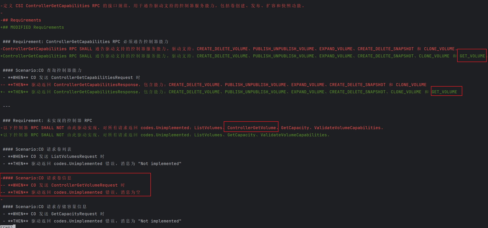

#### 2.4 Tasks任务阶段：拆成AI干活的清单

把规格翻译成开发任务，这个阶段的目标是：把 requirement 拆成工程上真正可以落地的任务清单。

```markdown
## 1. 新增 QueryVolumeHealth 接口

- [ ] 1.1 在 `csi/backend/plugin/plugin.go` 中定义 `VolumeHealth` 结构体（Healthy bool, Message string）
- [ ] 1.2 在 `StoragePlugin` interface 中新增 `QueryVolumeHealth` 方法签名
- [ ] 1.3 实现 SAN 存储 `QueryVolumeHealth`：查询 LUN 基本信息，检查 HEALTHSTATUS 字段
- [ ] 1.4 实现 NAS 存储 `QueryVolumeHealth`：仅查询 filesystem 存在性
- [ ] 1.5 实现 Dtree 存储 `QueryVolumeHealth`：仅查询 DTree 存在性

## 2. ControllerGetVolume 接口实现

- [ ] 2.1 在 `csi/driver/controller.go` 中实现 `ControllerGetVolume` 方法，校验 volume_id 参数
- [ ] 2.2 调用 `QueryVolumeHealth` 获取健康状态并构造 CSI 响应
- [ ] 2.3 处理存储后端不可用场景，返回 codes.Internal 错误
- [ ] 2.4 添加 ControllerGetVolume 相关日志记录

## 3. ControllerGetCapabilities 接口变更

- [ ] 3.1 在 `ControllerGetCapabilities` 返回中新增 `GET_VOLUME` 能力

## 4. 单元测试

- [ ] 4.1 编写 QueryVolumeHealth 单元测试：SAN 存储健康/异常场景
- [ ] 4.2 编写 QueryVolumeHealth 单元测试：NAS 存储存在/不存在场景
- [ ] 4.3 编写 QueryVolumeHealth 单元测试：Dtree 存储存在/不存在场景
- [ ] 4.4 编写 ControllerGetVolume 单元测试：健康状态映射到 CSI 响应
- [ ] 4.5 编写 ControllerGetVolume 单元测试：卷 ID 为空场景
- [ ] 4.6 编写 ControllerGetCapabilities 单元测试：验证返回 GET_VOLUME 能力

## 5. Helm 部署配置

- [ ] 5.1 在 `values.yaml` 中新增 `controller.volumeMonitor.enabled` 配置项，默认 false
- [ ] 5.2 在 `huawei-csi-controller.yaml` 中添加 `csi-external-health-monitor-controller:v0.10.0` sidecar 容器模板（条件渲染）
- [ ] 5.3 配置 sidecar 启动参数：`--csiAddress=/csi/csi.sock --monitor-interval=60s`
- [ ] 5.4 配置 sidecar 资源请求和限制
- [ ] 5.5 配置 sidecar 的 CSI socket 挂载卷
```

#### 重要

AI生成文档一定要人工审核，发现错误及时修改，及时澄清，非常重要！！！！大部分情况下，AI不是100%准确

澄清方式有两种：

1. 直接修改设计文档
2. 通过澄清，让AI自己更正设计：
   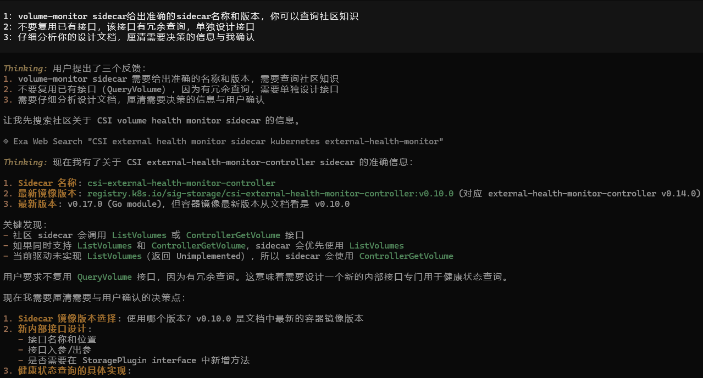

#### 2.5 Apply开发阶段：严格按规格编码
定稿后的规格直接交给AI编码，AI严格按照场景、报错、返回值要求开发。

生成的代码不再是”AI 觉得应该怎么写”，而是”规范规定了怎么写”。
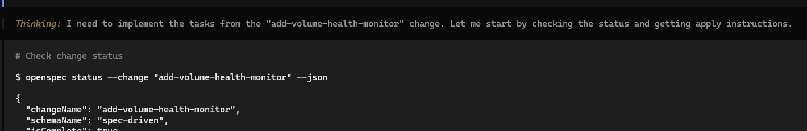

#### 2.6 Archive归档阶段：留存记录，方便后续追溯

开发完成后执行归档命令，把本次所有改动、文档、任务全部存档：

执行 /openspec:archive 命令，将本次变更归档。

```bash
/openspec:archive
```

该命令会将本次变更的规范、任务列表及结果总结归档到 openspec/changes 目录下，形成项目历史记录。这为未来的迭代项目维护和团队新成员理解上下文提供了极大便利

归档结果：一个新增特性，一个特性变更。


### 三： OpenSpec 工作流总结

#### 3.1 完整工作流回顾

这个项目的 OpenSpec 实践，分为两大阶段：

**阶段一：把存量项目纳入 OpenSpec**

- 扫描现有项目文件
- 梳理系统能力边界
- 生成基线规格
- 完成基线归档

**阶段二：在基线之上开发新需求**

```text
1. Propose（提案）
   ↓
   明确为什么要做卷监控、要新增和更改哪些capability
   
2. Design（设计）
   ↓
   确定采用独立查询接口，明确sidecar镜像信息和版本，明确卷健康状态的判断条件
   
3. Specs（规格）
   ↓
   把变更落实到 csi-controller-get-volume 和 csi-controller-get-capabilities 上面
   
4. Tasks（任务）
   ↓
   将规格拆成接口实现，安装部署文件修改等可执行任务
   
5. Apply（实现）
   ↓
   按任务落地代码，实现卷健康监控能力
   
6. Archive（归档）
   ↓
   完成变更归档，规格库新增1个 Requirements， 变更1个 Requirements

```

#### 3.2 传统开发 VS OpenSpec开发

| 维度   | 传统开发              | OpenSpec                                                 |
|------|-------------------|----------------------------------------------------------|
| 需求管理 | 依赖设计文档，易滞后、易失效    | 采用 Proposal+Design 模式，与代码演进保持同步（本次卷监控改动，文档、代码同步更新） |
| 设计评审 | 信息易遗漏、难追溯         | 基于 Design.md 开展评审，完整记录决策过程与依据                            |
| 规格沉淀 | 代码注释零散，维护成本高、可读性差 | 通过 Specs.md 固化需求与场景，形成统一规格基线                             |
| 任务拆分 | 根据个人开发习惯拆分        | 由 Tasks.md 自动生成任务，支持小步迭代、持续交付                            |
| 验收标准 | 标准模糊，测试理解不一致、易偏差  | 以场景化 Scenario 定义，验收口径统一、标准明确                             |
| 变更追溯 | 无记录，查不到改动原因    | 归档至 Archive，变更历史可查、可追溯                                |


#### 3.3 对其他团队的建议

**落地建议（渐进式引入）**
- 选取中等复杂度功能作为试点，验证流程可行性；
- 构建基础规格资产库，完成 6–10 项核心能力的规格定义；
- 持续扩展覆盖范围，逐步实现全功能模块的规格化管理；


## 四、实践过程思考

### 4.1 SDD 为什么要用 TDD？
在任务执行阶段，会要求先写测试，再编写代码，进行一个“红→绿→重构”的过程（TDD）。我猜测，这不仅是为了先约束边界，还有一个很大的原因是为了上下文考虑，
试想我们在同一个上下文中先完成开发，再让他写测试。那么开发产生的信息噪声就会影响开发工作。一个先写代码，再写测试的AI，就好比裁判下场踢球。
> Anthropic 的 Harness Design 文章：Agent往往会自信地称赞自己的作品——即使在人类观察者看来，作品的质量明显平庸


### 4.2 上下文为什么重要？
在提案阶段，会拉起一个SubAgent做代码分析工作，目的是不要让代码分析的上下文影响当前上下文。 这让我联想到在做长周期开发或编写一些Skill的时候，若不规划好上下文，很可能质量平平。
> Anthropic 的 Effective Context 文章：子代理架构提供了另一种绕过上下文限制的方法


## 写在最后
1. 要利用好AI，不是学工具怎么用，工具会变；Prompt怎么写，模型会进化；而是要理解软件工程底层思维，怎么拆问题，怎么管流程，怎么做质量控制。
2. 翻看各种AI实践案例，会发现一个规律，大家最终都会走到一条路上，不是因为互相抄，而是软件工程的底层方法论在那里。


### 参考文章

- [Harness design for long-running application development](https://www.anthropic.com/engineering/harness-design-long-running-apps)
- [Effective context engineering for AI agents](https://www.anthropic.com/engineering/effective-context-engineering-for-ai-agents)